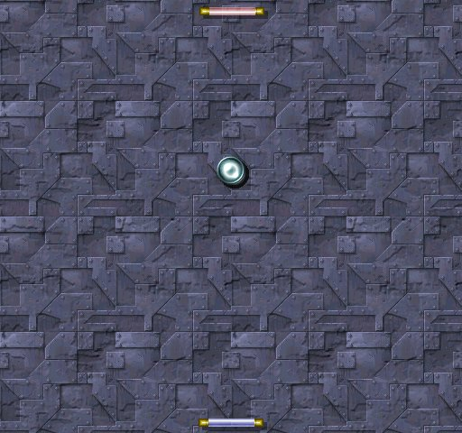



## DirectX8 Pong

### Description

DirectX8 Pong is a dinky little game that I made, just because I see all sorts of pong clones out there and I felt like adding my version to the list. My pong uses DirectX8 and has sound, music, and alpha textures to enhance the look. The ball control is pretty good, because it is based off the movement of the paddles. Everything is customizable, even the background, as well as the size, and speed, and difficulty....Enjoy.
 
### More Info
 

             |
---                |---
**Submitted On**   |2002-11-12 18:34:56
**By**             |[Andrew Stickney](https://github.com/Planet-Source-Code/PSCIndex/blob/master/ByAuthor/andrew-stickney.md)
**Level**          |Advanced
**User Rating**    |5.0 (10 globes from 2 users)
**Compatibility**  |VB 5\.0
**Category**       |[DirectX](https://github.com/Planet-Source-Code/PSCIndex/blob/master/ByCategory/directx__1-44.md)
**World**          |[Visual Basic](https://github.com/Planet-Source-Code/PSCIndex/blob/master/ByWorld/visual-basic.md)
**Archive File**   |[DirectX8\_P14964711122002\.zip](https://github.com/Planet-Source-Code/andrew-stickney-directx8-pong__1-40669/archive/master.zip)

